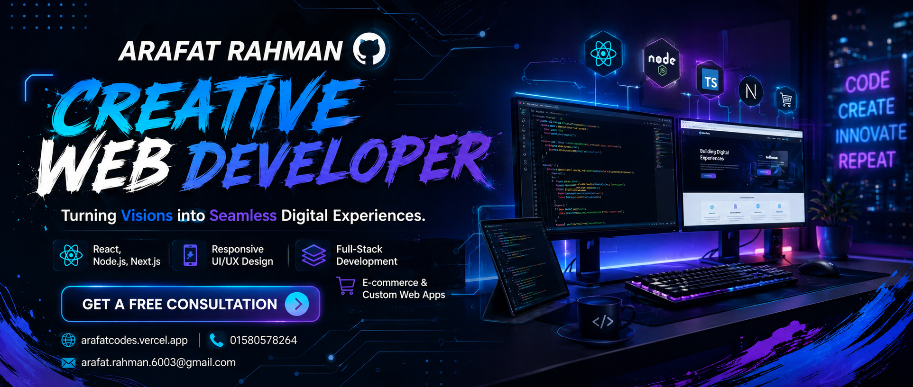

<!---->

 

 

  
  
  

  
  
  
  
  
  

 

## 🧑‍💻 About Me

I'm **Arafat Rahman**, a passionate **Full Stack Software Developer** from Bangladesh 🇧🇩, focused on building modern, scalable, secure, and high-performance web applications with the **MERN stack** and the broader modern web ecosystem.

I love turning ideas into production-ready digital products — from crafting beautiful, responsive interfaces to engineering secure backend systems, REST APIs, authentication flows, databases, and real-time features.

- 🔭 Currently building **SaaS applications**, **AI-powered products**, and scalable full-stack systems
- 🌱 Constantly sharpening my skills through real-world projects and modern best practices
- ⚡ I care about clean code, performance, and great user experience — in that order
- 🤝 Open to freelance work, collaborations, and interesting engineering problems
- 📫 Reach me at **arafat.rahman.6003@gmail.com**

 

## 🎯 Current Focus

<table>
<tr>
<td width="50%" valign="top">

**🚀 Building**
- AI-powered SaaS products
- Scalable full-stack architectures
- Real-time applications (chat, live data)

</td>
<td width="50%" valign="top">

**📚 Learning**
- Advanced system design
- Prisma & Drizzle ORM patterns
- AI integration in production apps

</td>
</tr>
</table>

## 🧠 Tech Stack

**Frontend**

 

**Backend**

 

**Database & ORM**

 

**DevOps & Tools**

## 🚀 Featured Projects

## 🚀 Featured Projects

<table>
<tr>
<td width="50%" valign="top">

## 🤖 AetherAI

> AI-powered SaaS platform for instant customer support.

**Tech:** Next.js • Node.js • MongoDB • AI

</td>

<td width="50%" valign="top">

## 🚖 Uber Clone

> Real-time ride booking application with authentication & live maps.

**Tech:** React • Express • MongoDB • Socket.io

</td>
</tr>

<tr>
<td width="50%" valign="top">

## 🛒 NextShop

> Modern Full Stack E-commerce platform.

**Tech:** Next.js • PostgreSQL • Prisma • Stripe

</td>

<td width="50%" valign="top">

## 💬 NexChat

> Real-time messaging application with authentication.

**Tech:** React • Socket.io • Express • MongoDB

</td>
</tr>

<tr>
<td width="50%" valign="top">

## 🏡 Home Rent

> Property browsing and rental platform.

**Tech:** React • Tailwind CSS

</td>

<td width="50%" valign="top">

## 💼 Portfolio Website

> Personal portfolio showcasing my projects and experience.

**Tech:** React • Tailwind CSS • Framer Motion

</td>
</tr>
</table>

## 📊 GitHub Analytics

 

  

### 🏆 GitHub Trophies

### 🐍 Contribution Snake

⚙️ Generated via a scheduled GitHub Action — see setup note at the bottom of this file.

## 💭 Quote of the Day

## 🎉 Fun Facts

- 🌐 I ship code from Bangladesh to users all over the world
- ⚡ I debug faster with coffee — but I'll never admit how much I drink
- 🧩 I genuinely enjoy the "impossible bug" moments more than the easy wins
- 🎮 When I'm not coding, I'm probably exploring new frameworks just to see what breaks

## 🤝 Let's Connect

  

 

 

Thanks for stopping by — let's build something great together! 🚀

<!--
SETUP NOTES (delete this comment block once configured):

1. Contribution Snake: add the workflow from https://github.com/Platane/snk to your
   Arafat-Rahman-603/Arafat-Rahman-603 repo (Settings → Actions) so it generates
   the "output" branch and SVG referenced above.
2. Buy Me a Coffee: replace "arafatrahman" in the link with your actual username,
   or remove the section if you don't use it.
3. WakaTime / Spotify widgets were left out since no account details were provided —
   ask if you'd like them added (they require linking your WakaTime API key or
   Spotify via a small third-party service).
-->
